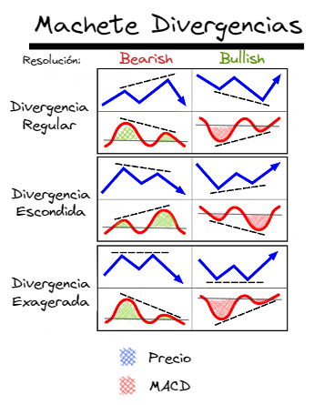

GRUPO 3: ANÁLISIS TÉCNICO: HERRAMIENTAS PARA BONOS Y ACCIONES: _INDICADOR MACD_
- Rancer Alvaro
- Almada Pablo
- Turuguet Santiago
- Cuminetti Coll Guido
- Franzoni Pedro

Para todos los casos pueden preparar un Power Point, paginas web, cuadros, pizarra, etc. Siempre colocando la Bibliografía consultada, ya que les quedará de material de estudio para todos.

Cada grupo va a tener como mínimo ==30 minutos y como máximo 45 minutos== para exponer su tema. 

Es actividad obligatoria para regularizar la materia.

# MACD

Fuentes:
- [MACD (indicador) - Qué es, definición y concepto - 2022 - Economipedia](https://economipedia.com/definiciones/macd-indicador.html)
- [MACD Indicator Explained, with Formula, Examples, and Limitations (investopedia.com)](https://www.investopedia.com/terms/m/macd.asp)
- Análisis Técnico de los Mercados Financieros. John J. Murphy. Capítulo 10.

Temas:
- tipos de indicadores y cantidad ideal para estrategias
- fórmula matemática para la creación del MACD
- explicación - correlación valle y crestas de las áreas que forman el indicador con ciclos del mercado
- idea de las convergencias y divergencias

## Introducción a los indicadores

Tipos:
- Tendencia: medir cuantificadamente la tendencia, la persistencia de los precios en moverse hacia una dirección determinada.
	- ADX (Average directional index)
	- Medias móviles
	- MACD (Moving Average Convergence Divergence)
	- Parabolico SAR
	- Regresión lineal
	- Forecast oscillator
- Volatilidad: magnitud de las fluctuaciones del periodo.
	- Averange True Range (Rango Medio Verdadero)
	- Banda de Bollinger
	- Desviación Estándar
	- Relative Volatility Index
	- Bandas de Error Estándar
	- Chaikin volatilidad
- Momentum (Momento): la velocidad a la que se mueven los precios en un periodo.
	- CCI (Commodity Channel Index)
	- RSI
	- Estocástico
	- Chande Momentum Oscillator
	- Williams %R
	- Williams Accumulation/Distribution
- Volumen
	- Ease Of Movement
	- Chaikin money flow
	- On Balance Volume
	- Rate of change
	- Demand index
	- Force index
- Ciclos: repetición de patrones de comportamientos cíclicos.
- Fuerza o fortaleza: cuantitativamente demuestra la fiabilidad del precio con respecto a la tendencia.
- Soportes y resistencias: identifica soportes y resistencia del chartismo.

Fuente:
- [Different Types of Trading Indicators: Trend, Momentum, Volatility and Volume (quantshare.com)](https://www.quantshare.com/sa-446-different-types-of-trading-indicators-trend-momentum-volatility-and-volume)
- [Análisis técnico: Tipos de indicadores - EduFintech](https://edufintech.net/finanzas-bursatiles/analisis-tecnico-tipos-de-indicadores/)

## Osciladores

Son indicadores extremadamente útiles en mercados sin tendencias en los que los precios se mueven en una banda de fluctuación horizontal (rango). (No quiere decir que en tendencias no se utilizan). Estos indicadores alertan al operador ante extremos del mercado a corto plazo, generalmente en condiciones de sobre compra o sobre vendido, también muestra la pérdida o ganancia de ímpetu.

Hay de saber que hay veces en lo que los osciladores son más útiles que en otras. Cerca del principio de movimientos importantes, el análisis del oscilador no es muy útil y puede incluso llevarnos en la dirección equivocada, en cambio, hacia el final de los movimientos de un mercado, los osciladores se vuelven extremadamente útiles.
Los picos y valles del oscilador suelen coincidir con los picos y valles del gráfico de precios. Algunos están normalizados en un valor medio 0 (cero).  Otros varían de 0 a 100.

Por lo general, cuando un oscilador alcanza un valor extremo tanto en la parte alta como en la parte baja de la banda, sugiere que el actual movimiento del precio puede haber ido demasiado lejos con demasiada rapidez y le hace falta una corrección o consolidación de algún tipo.

_Los 3 usos más importantes del oscilador:_ (En resumen)
- Cuando su valor alcanza una lectura extrema, en un límite superior o inferior.
- Una divergencia entre el oscilador y el movimiento del precio cuando el oscilador está en un extremo, este es una advertencia importante.
- Un cruce de línea cero (o media), puede dar importantes señales para operar en la dirección de la tendencia de precios.

### El momento como medida
El momento es la aplicación más básica del análisis del oscilador. Mide la velocidad del cambio de precios en oposición al nivel de precios en sí.
Para la construcción de una línea de momento de 10 días simplemente hay que restar el precio de cierre de hace 10 días del último precio de cierre.

$$M = V - Vx$$
V: último precio de cierre
Vx: precio de cierre de hace x días.

Este indicador mide las tasas de ascenso y descenso (aceleración o desaceleración) en un periodo (en la tendencia de precios). Si los precios están subiendo y la línea de momento está por encima de la línea cero y es ascendente, significa que la tendencia al alza se está acelerando. Si comienza a aplanarse, significa que las nuevas ganancias adquiridas por los últimos cierres son los mismos que hace $x$ días del periodo.

https://www.tradingview.com/x/HKk58oC5/

Por la forma en la que está constituida, la línea de momento está siempre un paso por delante del movimiento del precio.

_Señal:_ Un cruce por encima de la línea cero sería una señal de compra y un cruce por debajo de la línea cero sería una señal de venta. De todos modos debemos insistir en reconocer la verdadera tendencia, compramos en alcista, shorteamos en bajista bajo el anterior criterio.

Un problema de este gráfico de momento es la ausencia de un límite superior y otro inferior que sean fijos, para considerar ¿qué es demasiado alto o demasiado bajo? La forma más sencilla de solucionar esto es con la inspección visual, comparando líneas anteriores de momento.

https://www.tradingview.com/x/cj8jJD4t/

También se puede “normalizar” y utilizar la tasa de cambio como medición. La línea media se convierte en 100. La interpretación es la misma.

$$\Delta = 100 (\frac{V}{Vx})$$

### Oscilador usando dos medias móviles

Sabemos que con dos medias móviles y sus cruces podemos detectar señales de compra o venta. De la misma forma, haciendo la diferencia entre ellas, logramos un oscilador en forma de histograma. _Usos:_
- Detectar divergencias
- Identificar variaciones a corto plazo de la tendencia de largo plazo.
- Señalar con precisión los cruces de las dos medias móviles, que ocurre cuando el oscilador cruza la línea cero.

https://www.tradingview.com/x/V94xz6Mw/

## Convergencia / Divergencia de la media móvil (CDMM) (MACD)

Desarrollado por Gerald Appel, utiliza lo visto anteriormente en el cruce de 2 medias móviles con una adicional.

En su cálculo intervienen tres líneas.
1. La más rápida: línea MACD o CDMM (Compuesta por la diferencia de 2 medias móviles)
2. La más lenta: línea de señal

_Construcción:_

MACD: es la diferencia de medias móviles exponenciales de corta y largo período.

$$MACD = EMA_{corta} - EMA_{larga}$$
$$MACD = EMA_{12\ períodos} - EMA_{26\ períodos}$$

Señal: es una media móvil exponencial del MACD en 9 períodos.

$$SEÑAL = EMA_{9\ períodos} \ MACD$$

https://www.tradingview.com/x/Do26EY7S/

_Señales:_ Las señales de compra y venta aparecen cuando las dos líneas se cruzan, un MACD por encima de la señal se entiende como compra. Un MACD por debajo de la señal como venta.

Al fluctuar entre el valor cero, se pueden considerar los sectores superiores como sobre comprado y los inferiores como sobre vendido según los valores extremos que alcance este oscilador.

### Histograma del MACD
Como se vio anteriormente, la diferencia entre el MACD y la Señal logra la clásica figura del histograma. Cuando las líneas están apiladas por encima del cero, tiene una alineación positiva, es decir, un periodo de tendencia alcista. Cuando están apiladas por debajo del cero están en un periodo de tendencia bajista. (Para ambos casos pueden detectarse las correcciones o consolidaciones de precios de las tendencias primarias al largo plazo).

El cruce del cero coincide con el cruce de las medias, es decir, en el cambio de tendencia o las señales de compra o venta.

https://www.tradingview.com/x/rBZT00xF/

https://www.tradingview.com/x/oO6XuEvp/

El verdadero valor del histograma es detectar cuando se estrecha o se amplía la diferencia entre dos líneas. Cuando el histograma está por encima del cero, pero comienza a caer hacia la línea de cero, la tendencia alcista se está debilitando. Y viceversa.

Los cambios del histograma proporcionan advertencias más tempranas de que la tendencia actual está perdiendo momento. Los cambios que se dirigen a la línea de cero siempre preceden señales de cruces. Estos son muy útiles para detectar señales de salidas de posiciones existentes. Pero es mucho más peligroso usar los cambios del histograma como excusa para iniciar nuevas posiciones en contra de la tendencia prevaleciente.

### Divergencias

> [!info] _Divergencia:_ situación en la que dos indicadores no se confirman uno al otro. Por ejemplo, en el análisis de un oscilador, los precios tienden a subir mientras que un oscilador tiende a bajar. La divergencia normalmente advierte un cambio de tendencia.
> 

https://www.tradingview.com/x/6WJrsByy/

https://www.tradingview.com/x/IkQwem2T/

![[20221110 2022-11-08 02.27.04.excalidraw]]

![[machete_divergencias.png|600]]

## Importante
La mayor parte de las señales de compra del oscilador funcionan mejor en las tendencias alcistas, y las señales de venta del oscilador son más rentables en las tendencias a la baja.

El oscilador, tan útil como es, no deja de ser sólo una herramienta entre muchas otras, y siempre debe usarse como una ayuda y no como un substituto del análisis básico de la tendencia.

Preste menos atención al oscilador en las primeras etapas de un movimiento importante, pero preste mucha atención a las señales que hace a medida que los movimientos alcanzan la madurez.
